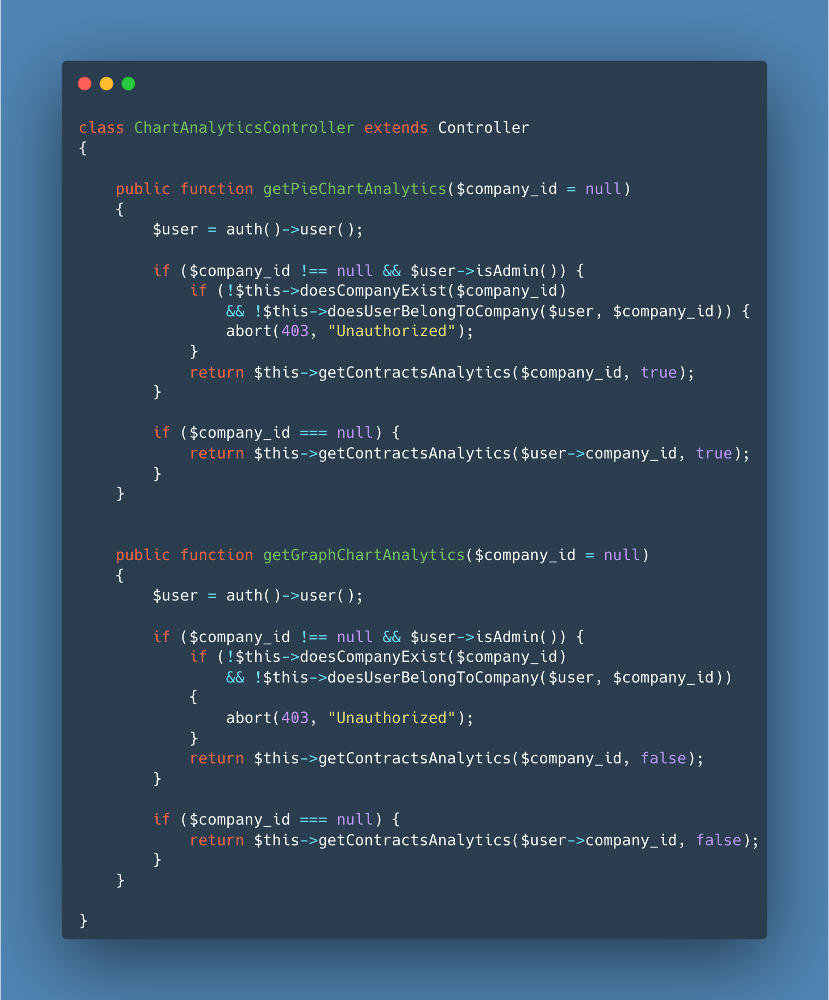
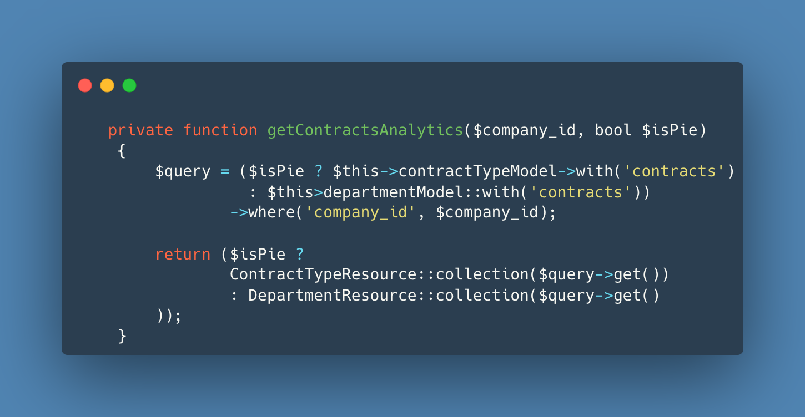
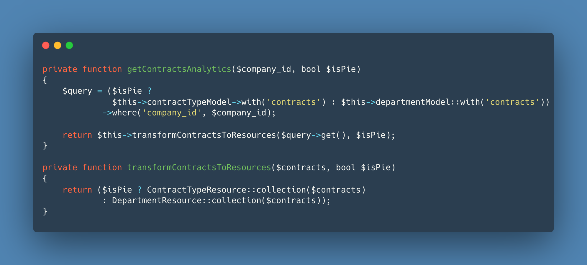

				                 Dimingo The Developer  
# Journey to Code Excellence: Embracing SOLID Principles

In the realm of software development, crafting code that not only functions as intended but is also clean, maintainable, and adaptable is a quest that every conscientious developer embarks upon. Over the past few months, I've been on an exhilarating journey, driven by an unrelenting obsession to ensure that my code remains comprehensible and robust, regardless of whether I'm actively involved in its maintenance. This pursuit has led me to explore the foundational principles of Object-Oriented Programming (OOP), with a particular focus on one that towers above the rest: SOLID.

## Unveiling SOLID Principles

SOLID is an acronym that encapsulates five fundamental principles, each with the potential to revolutionize the way we write code. I've delved deep into these principles, drawing wisdom from experienced developers such as Uncle Bob through their enlightening videos and talks. Join me as I take you on a journey through my discoveries and how these principles have etched an indelible mark on my coding philosophy.

## Code Refactoring: From Chaos to Clarity

My voyage into SOLID principles confronted me with a pivotal moment – the need to refactor a piece of code that held untapped potential for improvement. The code snippet below served as the canvas upon which I would apply SOLID principles to align it with best practices.



## PART 1
## Single Responsibility: A Guiding Light
The Single Responsibility Principle (SRP) serves as the bedrock of SOLID principles, advocating that a class or function should have a singular, well-defined reason to change. But what does this mean in practical terms? At its core, SRP emphasizes that every component in our codebase should serve a specific, well-defined purpose.

__``` Initial Code```__  





__```Refactored Code```__



<pre>

</pre>
In this first part, I've shared insights into the **"S"** in SOLID, illustrating how the __Single Responsibility__ Principle has guided me towards code that not only works but is also elegant, maintainable, and adaptable. Stay tuned for the subsequent parts of this journey, where we'll dive deeper into the remaining SOLID principles and witness how they transform code chaos into code excellence.